# AstrBot 软件工程视角分析（详细版）

> 本文档从软件工程角度对 AstrBot 框架进行全面、深入的系统性分析，涵盖架构风格、设计模式、质量属性、API 设计、时序行为、UML 建模、安全分析、测试策略、技术债务等核心议题。

---

## 目录

- [一、架构风格分析](#一架构风格分析)
- [二、核心设计模式](#二核心设计模式)
- [三、质量属性分析](#三质量属性分析)
- [四、API 设计与开发者体验](#四api-设计与开发者体验)
- [五、模块化与耦合度分析](#五模块化与耦合度分析)
- [六、Mermaid 时序图（动态行为分析）](#六mermaid-时序图动态行为分析)
- [七、UML 可视化建模](#七uml-可视化建模)
- [八、文件索引与代码地图](#八文件索引与代码地图)
- [九、安全分析](#九安全分析)
- [十、测试策略分析](#十测试策略分析)
- [十一、技术债务清单](#十一技术债务清单)
- [十二、版本演进与兼容性](#十二版本演进与兼容性)
- [十三、性能基准与优化建议](#十三性能基准与优化建议)
- [十四、工程实践亮点与可改进点](#十四工程实践亮点与可改进点)
- [十五、总结与工程启示](#十五总结与工程启示)
- [附录 A：完整文件索引](#附录-a完整文件索引)
- [附录 B：核心配置项速查](#附录-b核心配置项速查)
- [附录 C：Provider 适配器速查表](#附录-cprovider-适配器速查表)
- [附录 D：平台适配器速查表](#附录-d平台适配器速查表)

---

## 一、架构风格分析

### 1.1 混合架构：管道-过滤器 × 微内核 × 事件驱动

AstrBot 并非采用单一架构风格，而是**三种经典架构的深度融合**，每种风格都有明确的应用边界：

| 架构风格 | 体现位置 | 核心价值 |
|---------|---------|---------|
| **管道-过滤器** | 消息处理管道（9 个 Stage） | 关注点分离、可插拔、独立测试 |
| **微内核/插件化** | Star 插件系统 + Handler 机制 | 可扩展性、热插拔、零配置注册 |
| **事件驱动** | EventBus + 异步调度 | 解耦、并发、响应性 |

```
┌─────────────────────────────────────────────────────────────────────┐
│                        AstrBot 混合架构                              │
├─────────────────────────────────────────────────────────────────────┤
│                                                                     │
│   ┌─────────────────────────────────────────────────────────────┐   │
│   │                    用户层（Plugins）                          │   │
│   │   ┌─────────┐  ┌─────────┐  ┌─────────┐  ┌─────────┐       │   │
│   │   │ Plugin A│  │ Plugin B│  │ Plugin C│  │ Plugin N│       │   │
│   │   └────┬────┘  └────┬────┘  └────┬────┘  └────┬────┘       │   │
│   │        │              │              │              │          │   │
│   │        └──────────────┴──────┬───────┴──────────────┘       │   │
│   │                               ▼                                │   │
│   │                     微内核接口（Context）                       │   │
│   └─────────────────────────────────┬─────────────────────────────┘   │
│                                     │                               │
│   ┌─────────────────────────────────▼─────────────────────────────┐   │
│   │                    核心层（Core）                              │   │
│   │                                                               │   │
│   │   ┌─────────────────────────────────────────────────────┐     │   │
│   │   │          管道-过滤器（Pipeline）                       │     │   │
│   │   │  ┌────┐ ┌────┐ ┌────┐ ┌────┐ ┌────┐ ┌────┐ ┌────┐ │     │   │
│   │   │  │S1 │→│S2 │→│S3 │→│S4 │→│S5 │→│S6 │→│S7 │→ ... │     │   │
│   │   │  └────┘ └────┘ └────┘ └────┘ └────┘ └────┘ └────┘ │     │   │
│   │   └─────────────────────────────────────────────────────┘     │   │
│   │                                                               │   │
│   │   ┌─────────────────────────────────────────────────────┐     │   │
│   │   │          事件驱动（EventBus）                         │     │   │
│   │   │    Platform ──► EventBus ──► PipelineScheduler       │     │   │
│   │   └─────────────────────────────────────────────────────┘     │   │
│   │                                                               │   │
│   │   ┌──────────────┐  ┌──────────────┐  ┌──────────────┐       │   │
│   │   │  Agent 系统   │  │ Provider 体系 │  │ 平台适配层    │       │   │
│   │   └──────────────┘  └──────────────┘  └──────────────┘       │   │
│   └─────────────────────────────────────────────────────────────┘   │
│                                                                     │
│   ┌─────────────────────────────────────────────────────────────┐   │
│   │                    基础设施层（Infrastructure）                │   │
│   │   ┌────────┐  ┌────────┐  ┌────────┐  ┌────────┐           │   │
│   │   │ SQLite │  │ FAISS │  │ FastAPI │  │ 日志   │           │   │
│   │   └────────┘  └────────┘  └────────┘  └────────┘           │   │
│   └─────────────────────────────────────────────────────────────┘   │
└─────────────────────────────────────────────────────────────────────┘
```

### 1.2 管道-过滤器架构

**管道-过滤器**是 AstrBot 最核心的架构风格。9 个 Stage 构成处理链，每个 Stage 都是一个独立的"过滤器"：

```
                  ┌──────────────┐
    Message ────► │ Pipeline     │
    Event         │ Scheduler    │
                  └──────┬───────┘
                         │
         ┌───────────────┼───────────────┐
         ▼               ▼               ▼
    ┌─────────┐     ┌─────────┐     ┌─────────┐
    │ Stage 1 │     │ Stage 2 │     │ Stage 3 │  ...
    │  Waking │────►│Whitelist│────►│ Session │──► ...
    │  Check  │     │  Check  │     │ Status  │
    └─────────┘     └─────────┘     └─────────┘
         │               │               │
    可插拔/替换      可插拔/替换      可插拔/替换
    独立测试         独立测试         独立测试
```

**工程价值**：
- **高内聚低耦合**：每个 Stage 只关心自己的职责（唤醒检查、频率限制、内容安全等），Stage 之间通过 `PipelineContext` 共享状态，通过 `AstrMessageEvent` 传递数据。
- **可插拔性**：新增 Stage 只需继承 `Stage` 基类，实现 `process()` 方法，通过 `@register_stage` 装饰器注册到全局列表。无需修改其他 Stage 代码。
- **独立可测试**：每个 Stage 可独立进行单元测试，只需 mock `PipelineContext` 和 `AstrMessageEvent`。

**实现巧妙之处**：利用 Python 的 `AsyncGenerator` 特性实现"洋葱模型"——前置逻辑在 `yield` 之前执行，后置逻辑在递归返回后执行。这使得一个 Stage 既能处理进入时的逻辑，也能处理后续 Stage 执行完毕后的清理逻辑。

### 1.3 微内核插件架构

Star 插件系统体现了**微内核架构**的核心思想：

- **内核（Kernel）**：AstrBot Core 提供最小化的核心能力（管道调度、事件分发、Agent 运行）。
- **扩展点（Extension Points）**：通过 `Star` 基类、`Context` 上下文、`EventType` 事件类型提供扩展接口。
- **插件（Plugins）**：所有业务逻辑以插件形式存在，通过扩展点接入系统。

```
┌─────────────────────────────────────────┐
│              AstrBot 内核（Core）         │
│                                          │
│  最小化核心能力：                         │
│  • 管道调度引擎（PipelineScheduler）      │
│  • Agent 执行引擎（ToolLoopAgentRunner）  │
│  • 事件分发（EventBus）                   │
│  • Provider 管理（ProviderManager）       │
│                                          │
│  扩展接口（Extension Points）：            │
│  • Star 基类 ──► 业务逻辑插件             │
│  • EventType ──► 事件钩子挂载            │
│  • FunctionTool ──► LLM 工具注册         │
│  • HandlerFilter ──► 消息过滤策略        │
└──────────────┬──────────────────────────┘
               │ 扩展接口
    ┌──────────┼──────────┐
    ▼          ▼          ▼
┌────────┐┌────────┐┌────────┐
│Plugin A││Plugin B││Plugin C│
│(翻译)  ││(天气)  ││(管理)  │
└────────┘└────────┘└────────┘
```

**自动注册机制**：`Star.__init_subclass__` 利用 Python 的元类特性，在类定义时自动注册到全局注册表，开发者只需继承 `Star` 即可完成注册。

### 1.4 事件驱动架构

`EventBus` 体现了事件驱动架构的核心：

```
┌─────────┐    推送     ┌─────────┐    调度     ┌─────────────────┐
│ Platform │──────────► │ EventBus │──────────► │ PipelineScheduler│
│ (适配层) │  asyncio.Queue│(事件总线)│  create_task │(管道调度器)    │
└─────────┘             └─────────┘             └────────┬────────┘
                                                        │
                   不阻塞平台回调                        │ 独立协程
                                                        ▼
                                                  ┌──────────────┐
                                                  │ 消息处理管道  │
                                                  │ (9 Stages)   │
                                                  └──────────────┘
```

**解耦效果**：平台适配器（如 QQ、Telegram）只需将消息推送到 `EventBus`，无需关心消息如何处理、由谁处理、耗时多久。所有处理逻辑通过 `PipelineScheduler` 以独立协程形式异步执行。

---

## 二、核心设计模式

### 2.1 策略模式（Strategy）

**应用场景**：内容安全检查（ContentSafetyCheck）

```python
class StrategySelector:
    strategies: list[ContentSafetyStrategy]
    def check(self, text: str) -> bool:
        for strategy in self.strategies:
            if not strategy.check(text):
                return False
        return True

class InternalKeywordsStrategy(ContentSafetyStrategy):
    keywords: list[str]

class BaiduAIPStrategy(ContentSafetyStrategy):
    api_key: str
```

**另一应用**：Agent 的 `tool_schema_mode`（`full` / `skills_like`），运行时选择不同的工具 Schema 模式。

### 2.2 观察者模式（Observer）

**应用场景**：事件钩子系统（Event Hooks）

```python
class EventType(enum.Enum):
    OnLLMRequestEvent = auto()
    OnLLMResponseEvent = auto()
    OnAgentBeginEvent = auto()
    OnAgentDoneEvent = auto()
    OnDecoratingResultEvent = auto()
    # ... 共 14 种事件类型

async def call_event_hook(event, event_type, *args):
    for handler in star_handlers_registry.get_handlers_by_event_type(event_type):
        await handler.handler(event, *args)
```

**工程价值**：插件可订阅感兴趣的事件，实现非侵入式扩展。例如翻译插件可订阅 `OnDecoratingResultEvent`，在消息发送前进行翻译。

### 2.3 适配器模式（Adapter）

**应用场景**：Provider 体系（40+ 适配器）和平台适配层（17+ 适配器）

```python
@register_provider_adapter(provider_type_name="openai", ...)
class OpenAISource(Provider):
    """将 OpenAI API 适配为 Provider 接口"""

@register_provider_adapter(provider_type_name="ollama", ...)
class OllamaSource(Provider):
    """将 Ollama API 适配为 Provider 接口"""

@register_platform_adapter(platform_name="qq", ...)
class AIOCQHTTP(Platform):
    """将 QQ 协议适配为 Platform 接口"""
```

### 2.4 装饰器模式 / 洋葱模型（Decorator / Onion）

**应用场景**：Stage 的 `AsyncGenerator` 实现

```
                  ┌──────────────────────┐
                  │    Stage 1 (Waking)  │
                  │  ┌────────────────┐  │
                  │  │ 前置逻辑      │  │
                  │  │ (检查唤醒条件) │  │
                  │  └───────┬────────┘  │
                  │          │ yield      │
                  │          ▼            │
                  │  ┌────────────────┐  │
                  │  │    Stage 2     │  │
                  │  │  ┌──────────┐  │  │
                  │  │  │ 前置逻辑  │  │  │
                  │  │  │(白名单检查)│  │  │
                  │  │  └────┬─────┘  │  │
                  │  │       │ yield   │  │
                  │  │       ▼        │  │
                  │  │   Stage 3 ...  │  │
                  │  │       │        │  │
                  │  │ 后置逻辑      │  │
                  │  │ 清理/记录     │  │
                  │  └────────────────┘  │
                  │          │            │
                  │          ▼            │
                  │ 后置逻辑              │
                  │ (日志/统计)           │
                  └──────────────────────┘
```

### 2.5 模板方法模式（Template Method）

**应用场景**：Stage 基类定义算法骨架

```python
class Stage(abc.ABC):
    async def initialize(self, ctx: PipelineContext) -> None:
        await self._do_initialize(ctx)

    @abc.abstractmethod
    async def process(self, event: AstrMessageEvent) -> None | AsyncGenerator:
        ...

    async def _do_initialize(self, ctx: PipelineContext) -> None:
        pass
```

### 2.6 工厂方法模式（Factory Method）

**应用场景**：Stage 自动加载与 Provider 动态创建

```python
# Stage 工厂：PipelineScheduler.__init__ 中按注册顺序创建实例
for stage_cls in registered_stages:
    stage_instance = stage_cls()
    await stage_instance.initialize(self.ctx)

# Provider 工厂：ProviderManager 按配置动态创建
metadata = provider_cls_map.get(config["type"])
cls = metadata.cls_type
provider = cls(config, settings)
```

### 2.7 责任链模式（Chain of Responsibility）

**应用场景**：Handler 过滤器链

```python
class StarHandlerMetadata:
    event_filters: list[HandlerFilter]

    def match(self, event, cfg) -> bool:
        for filter in self.event_filters:
            if not filter.filter(event, cfg):
                return False
        return True
```

一个 Handler 可同时挂载 `CommandFilter`（匹配命令）+ `PermissionFilter`（检查权限）+ `EventMessageTypeFilter`（限制消息类型）。

### 2.8 注册表模式（Registry）

**应用场景**：多种全局注册表

```python
star_map: dict[str, StarMetadata] = {}
star_registry: list[StarMetadata] = []
provider_registry: list[ProviderMetaData] = []
provider_cls_map: dict[str, ProviderMetaData] = {}
registered_stages: list[type[Stage]] = []
tools_registry: dict[str, type[FunctionTool]] = {}
```

### 2.9 单例模式（Singleton）

**应用场景**：全局管理器类

```python
_star_manager: PluginManager
_provider_manager: ProviderManager
_pipeline_scheduler_mapping: dict[str, PipelineScheduler]
_event_bus: EventBus
_database: AstrBotDatabase
```

### 2.10 其他隐含设计模式

| 模式 | 应用场景 | 位置 |
|------|---------|------|
| **代理模式** | `Context` 作为插件访问核心能力的代理 | `core/star/context.py` |
| **外观模式** | `PipelineScheduler` 对外暴露统一的 `execute()` 接口 | `core/pipeline/scheduler.py` |
| **中介者模式** | `EventBus` 作为 Platform 与 Pipeline 之间的中介 | `core/event_bus.py` |
| **迭代器模式** | Agent 的 `async for` 遍历 LLM 流式响应 | `core/agent/runners/` |
| **对象池模式** | `_pending_tasks` 持有正在执行的协程引用防 GC | `core/event_bus.py` |

---

## 三、质量属性分析

### 3.1 可扩展性（Extensibility）

AstrBot 在可扩展性方面表现优异，体现在四个维度：

**扩展机制对比**：

| 扩展点 | 难度 | 所需知识 | 典型场景 |
|--------|------|---------|---------|
| Star 插件 | ★☆☆ | API 文档 | 添加命令、LLM 工具、事件响应 |
| Provider | ★★☆ | HTTP API、异步编程 | 接入新 AI 服务 |
| Platform | ★★★ | 网络协议、IM 知识 | 支持新聊天平台 |
| Stage | ★★★★ | 管道机制、洋葱模型 | 添加新的处理环节 |

**扩展方式详解**：

```
Star 插件扩展：
1. 继承 Star 基类
2. 使用 @register 装饰器（可选）
3. 在 initialize() 中注册 Handler/Tools
4. 重启后自动加载
→ 扩展成本：极低，无需修改核心代码

Provider 扩展：
1. 继承 Provider / STTProvider / TTSProvider / EmbeddingProvider / RerankProvider
2. 使用 @register_provider_adapter 装饰器注册
3. 实现对应抽象方法
→ 扩展成本：低，只需实现抽象方法

Platform 扩展：
1. 继承 Platform 基类
2. 使用 @register_platform_adapter 装饰器注册
3. 实现 connect() / disconnect() / send_message() / handle_event()
→ 扩展成本：中等，需处理平台特有协议

Stage 扩展：
1. 继承 Stage 基类
2. 使用 @register_stage 装饰器注册
3. 实现 initialize() 和 process()（返回 AsyncGenerator 实现洋葱模型）
4. 在 STAGES_ORDER 中指定执行顺序
→ 扩展成本：较高，需理解管道机制
```

### 3.2 可维护性（Maintainability）

**优势**：
- **高内聚低耦合**：每个模块职责单一。`pipeline/` 处理消息流、`agent/` 处理 LLM 交互、`provider/` 对接 AI 服务、`platform/` 处理平台适配。
- **清晰的分层**：基础设施层 → 核心层 → 用户层，依赖方向单向。
- **统一的命名**：类名、方法名、文件名遵循统一约定。
- **类型标注**：全面使用 Python Type Hints，IDE 支持良好。

**可改进点**：
- 部分 `core/` 顶层模块文件较大（如 `astr_main_agent.py`），可进一步拆分。
- 部分配置项分散在多个模块中，可考虑集中管理。
- `core/platform/sources/` 下每个平台都是独立子目录，代码重复度偏高。

### 3.3 性能（Performance）

**异步并发设计**：

```
1. EventBus.dispatch() 主循环
   while True:
       event = await queue.get()
       task = create_task(scheduler.execute(event))
       # 每个事件独立协程，不阻塞主循环

2. PipelineScheduler._process_stages() 递归
   async def _process_stages(event, from_stage):
       for stage in stages:
           coroutine = stage.process(event)
           if isinstance(coroutine, AsyncGenerator):
               async for _ in coroutine:
                   await self._process_stages(event, i+1)

3. Agent 流式响应
   async for chunk in provider.text_chat_stream(...):
       yield chunk  # 逐块返回，边生成边发送

4. Embedding 批量并行
   asyncio.gather(*[process_batch(i, batch) ...])
   # 多任务并发，带 Semaphore 控制并发数

5. 会话锁
   session_lock_manager.acquire_lock(umo)
   # 防止同一会话的并发请求冲突
```

**关键性能优化**：
- **流式响应**：`streaming_response` 配置支持边生成边发送，显著降低首 token 延迟。
- **Embedding 并行批处理**：`get_embeddings_batch()` 使用 `asyncio.Semaphore` 控制并发度。
- **会话级缓存**：`session_lock_manager` 避免同一会话的重复计算。
- **Token 估算器**：`EstimateTokenCounter` 避免为估算 token 而发起额外 LLM 请求。
- **Skill-like 工具模式**：减少不必要的 Schema 传递，节省 token。
- **asyncio Task 强引用**：`_pending_tasks` 防止协程在 pending 状态被 GC 回收。

### 3.4 可靠性（Reliability）

**多层次的错误处理**：

```
Layer 1: 平台适配层
• 捕获平台特有异常
• 重试机制（指数退避）

Layer 2: EventBus
• _on_task_done 回调处理异常
• Pipeline task 的异常不会影响主循环

Layer 3: Pipeline Stage
• 每个 Stage 可独立 try-except
• event.stop_event() 停止后续处理

Layer 4: Agent 系统
• EMPTY_OUTPUT_RETRY_ATTEMPTS = 3 空输出重试
• REPEATED_TOOL_NOTICE 重复工具提醒（3/4/5 级）
• MAX_STEPS_REACHED_PROMPT 最大步数终止
• 会话锁超时释放

Layer 5: Provider 层
• request_max_retries 请求级重试
• fallback_providers 备用 Provider
• 安全检查（blocked API base）
• tenacity 重试库支持

Layer 6: 内容安全
• ContentSafetyCheck 前置过滤
• ContentSafetyCheck 结果复检
```

### 3.5 可观测性（Observability）

- **结构化日志**：`astrbot_config_mgr` 日志配置，`core/log.py` 日志系统
- **Dashboard 实时监控**：FastAPI WebSocket 推送日志流
- **Token 用量统计**：`TokenUsageRecord` 数据库记录，Dashboard 可视化
- **Agent 运行统计**：`AgentStats` 记录耗时、Token 使用、步数
- **Metric 上报**：`Metric.upload()` 发送遥测数据
- **活跃事件注册表**：`active_event_registry` 跟踪当前正在处理的事件

### 3.6 安全性（Security）

详见第九章"安全分析"。

### 3.7 可移植性（Portability）

- **Python 跨平台**：支持 Windows、Linux、macOS
- **Docker 支持**：官方提供 Docker 镜像
- **配置文件 JSON**：配置与代码分离，便于环境迁移
- **环境变量**：支持通过环境变量覆盖配置项

---

## 四、API 设计与开发者体验

### 4.1 开发者体验（DX）评价

AstrBot 对插件开发者的 API 设计堪称教科书级别：

**优点 1：最小化 API 表面**

```python
class MyPlugin(Star):
    async def initialize(self) -> None: ...    # 注册 Handler/Tools
    async def terminate(self) -> None: ...     # 释放资源

    @filter.command("hello")
    async def hello_command(self, event):
        await event.reply("Hello!")
```

**优点 2：装饰器式声明注册**

```python
@filter.command("search", "搜索命令")
@filter.regex(r"天气|weather")
@filter.permission("admin")
async def handle_weather(self, event):
    await event.reply("今天阳光明媚")
```

**优点 3：Context 作为受控 API**

```python
class Context:
    get_config()              # 获取插件配置
    register_tool(tool)       # 注册 LLM 工具
    register_event_listener() # 注册事件监听
    register_commands()       # 注册命令
```

**优点 4：统一事件参数**

所有事件 Handler 接收 `(event, ...)` 参数，第一个参数始终是 `AstrMessageEvent`。

### 4.2 内部 API 一致性

**Provider 体系的一致性设计**：

```python
class Provider(AbstractProvider):
    async def text_chat(...) -> LLMResponse: ...
    async def text_chat_stream(...) -> AsyncGenerator[LLMResponse]: ...

class STTProvider(AbstractProvider):
    async def get_text(audio_url) -> str: ...

class TTSProvider(AbstractProvider):
    async def get_audio(text) -> str: ...
    def support_stream() -> bool: return False

class EmbeddingProvider(AbstractProvider):
    async def get_embedding(text) -> list[float]: ...
    async def get_embeddings(texts) -> list[list[float]]: ...
    def get_dim() -> int: ...

class RerankProvider(AbstractProvider):
    async def rerank(query, documents, top_n) -> list[RerankResult]: ...
```

### 4.3 API 设计原则分析

| 原则 | 体现 | 示例 |
|------|------|------|
| **接口隔离** | 5 种 Provider 各司其职 | `STTProvider` 不暴露 `text_chat` |
| **依赖倒置** | 上层依赖抽象而非具体 | Agent 依赖 `Provider` 抽象 |
| **里氏替换** | 任何 Provider 可替换另一个 | `OllamaSource` 可替换 `OpenAISource` |
| **最少知识** | Context 只暴露必要接口 | 插件无法直接访问 PipelineScheduler |
| **稳定接口** | 抽象层定义稳定契约 | `text_chat()` 签名稳定 |
| **迪米特法则** | 对象间最少通信 | 插件通过事件钩子间接通信 |

---

## 五、模块化与耦合度分析

### 5.1 依赖关系分析

```
                    ┌─────────────────────┐
                    │    用户插件层        │
                    │  (plugins/*.py)    │
                    └──────────┬──────────┘
                               │ 依赖
                    ┌──────────▼──────────┐
                    │     Star 核心层      │
                    │  (core/star/)      │
                    └──────────┬──────────┘
                               │ 依赖
              ┌────────────────┼────────────────┐
              ▼                ▼                ▼
    ┌──────────────┐  ┌──────────────┐  ┌──────────────┐
    │  Pipeline 层  │  │   Agent 层   │  │  Provider 层 │
    │(core/pipeline)│  │ (core/agent) │  │(core/provider)│
    └──────┬───────┘  └──────┬───────┘  └──────┬───────┘
           │                │                │
           └────────────────┼────────────────┘
                            │ 共同依赖
                 ┌──────────▼──────────┐
                 │    平台适配层        │
                 │  (core/platform/)  │
                 └──────────┬──────────┘
                            │
                 ┌──────────▼──────────┐
                 │     基础设施层       │
                 │  (core/db/, config) │
                 └─────────────────────┘
```

**依赖方向**：用户层 → 核心层 → 平台层 → 基础设施层，严格的单向依赖。

### 5.2 耦合度评估

| 模块对 | 耦合类型 | 耦合度 | 说明 |
|--------|---------|--------|------|
| Star ↔ Pipeline | 松耦合 | ★☆☆ | 通过 `Context` 接口交互，Pipeline 不直接依赖 Star |
| Pipeline ↔ Provider | 松耦合 | ★☆☆ | 通过 `ProviderRequest`/`LLMResponse` 数据类交互 |
| Agent ↔ Provider | 松耦合 | ★★☆ | Agent 依赖 `Provider` 抽象接口 |
| Platform ↔ Pipeline | 松耦合 | ★☆☆ | 通过 `EventBus` 解耦 |
| Provider ↔ Provider | 零耦合 | ☆☆☆ | 各 Provider 独立实现 |
| Star ↔ Star | 零耦合 | ☆☆☆ | 插件间通过事件钩子间接通信 |

### 5.3 数据类（Data Class）作为契约

```python
# Pipeline ↔ Agent
@dataclass
class ProviderRequest:
    prompt: str | None = None
    contexts: list[dict] = field(default_factory=list)
    func_tool: ToolSet | None = None
    system_prompt: str = ""

@dataclass
class LLMResponse:
    role: str
    result_chain: MessageChain | None = None
    tools_call_args: list[dict] = field(default_factory=list)

# Agent ↔ Provider
@dataclass
class ToolCallsResult:
    tool_calls_info: AssistantMessageSegment
    tool_calls_result: list[ToolCallMessageSegment]
```

**工程意义**：数据类作为稳定的"消息格式"，使得模块间的契约独立于实现变化。

---

## 六、Mermaid 时序图（动态行为分析）

### 6.1 场景一：用户发送消息到收到回复的完整流程

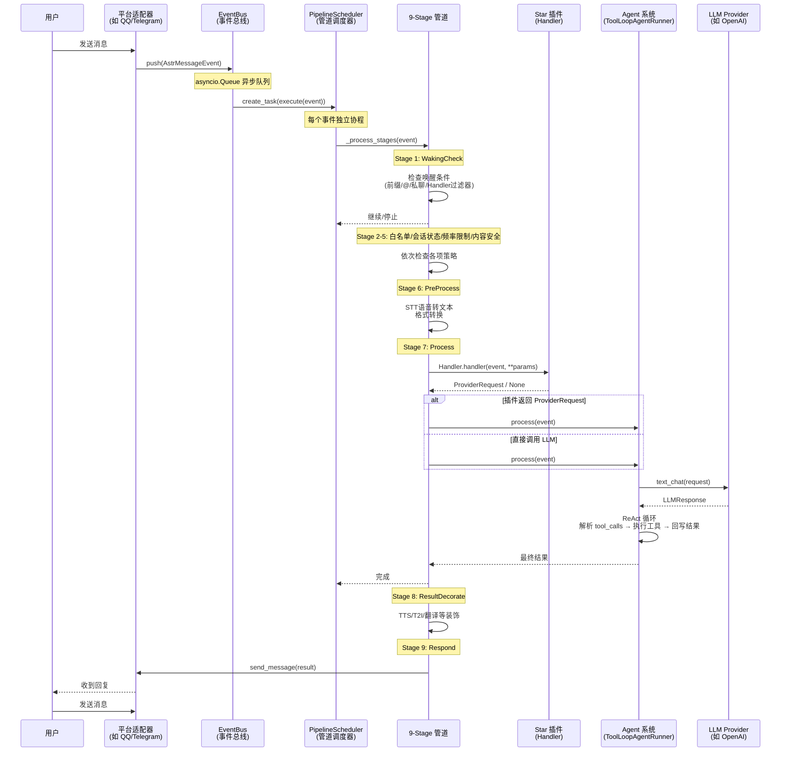

### 6.2 场景二：Agent ReAct 循环

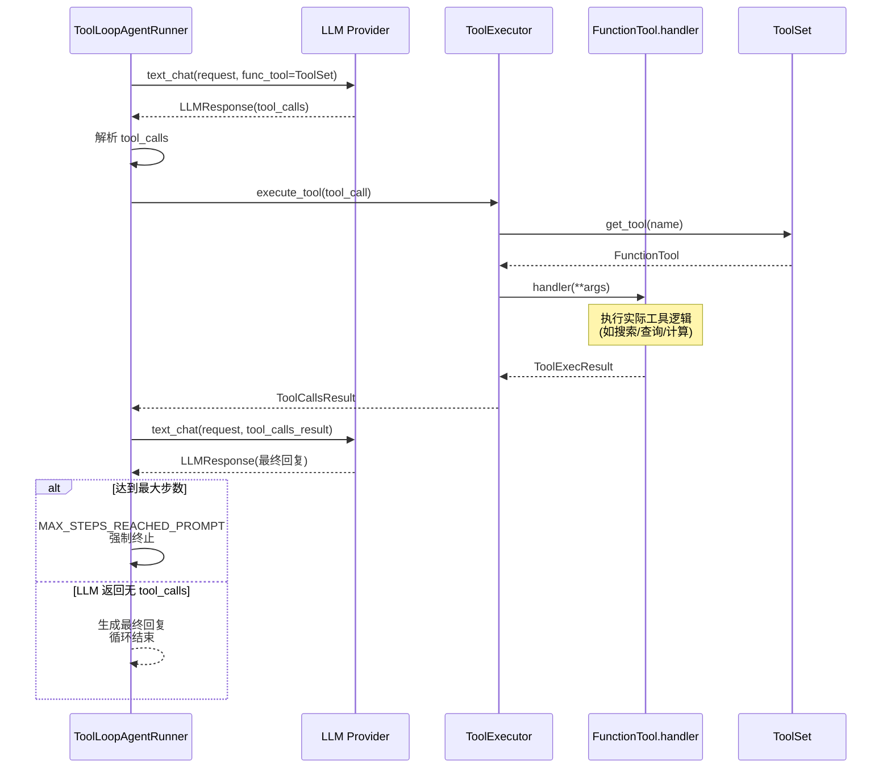

### 6.3 场景三：洋葱模型递归执行

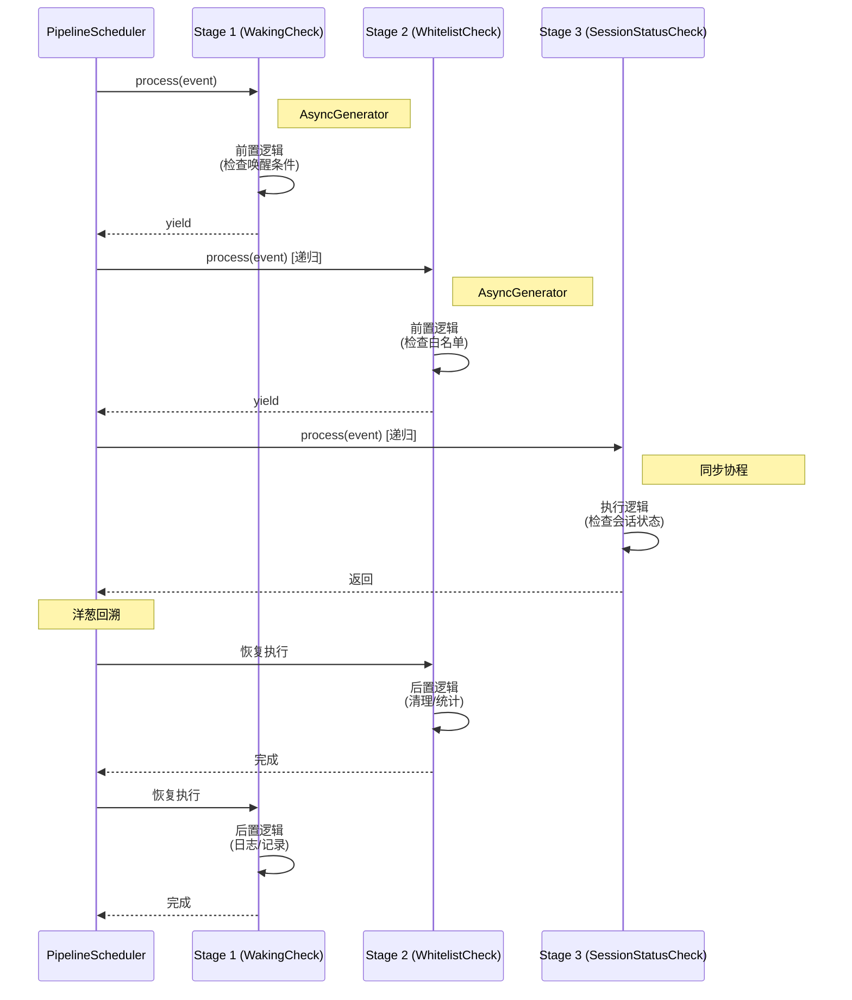

### 6.4 场景四：流式响应处理

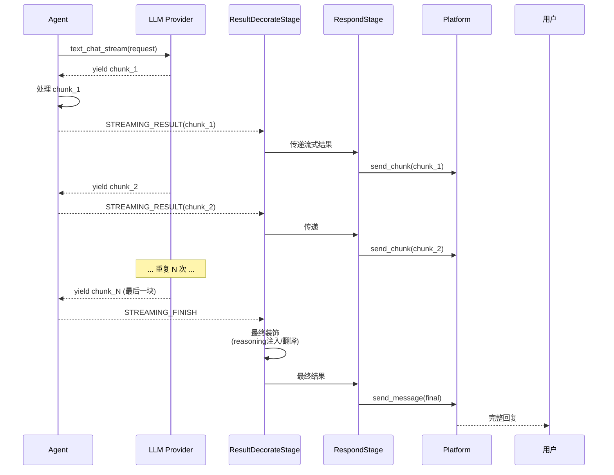

### 6.5 场景五：插件注册与激活

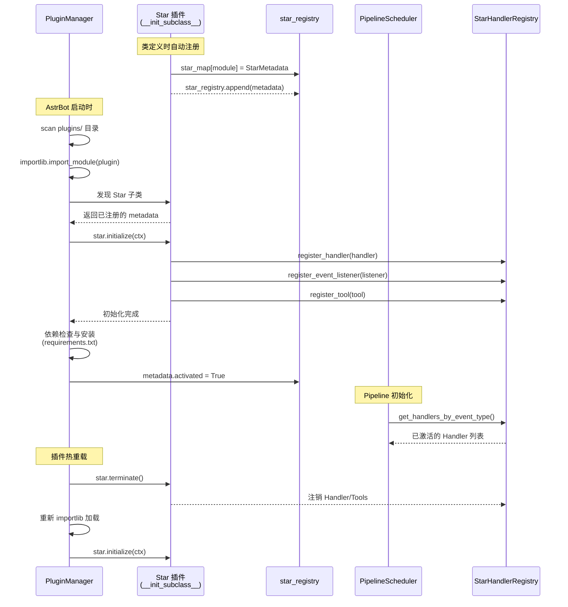

### 6.6 场景六：Follow-up 跟进机制

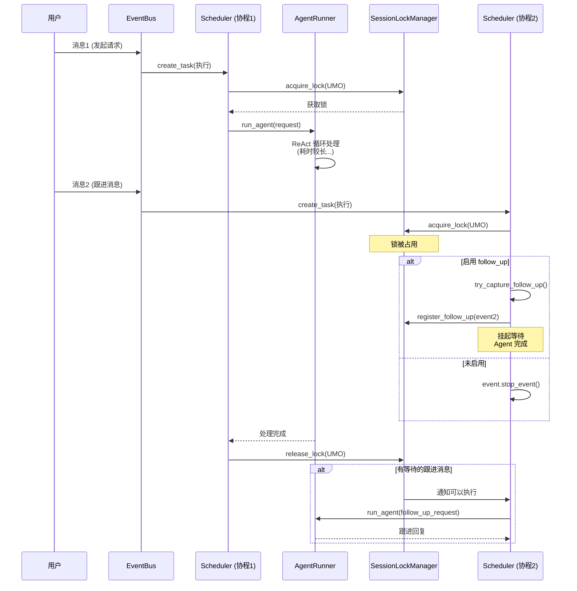

---

## 七、UML 可视化建模

### 7.1 用例图（Use Case Diagram）

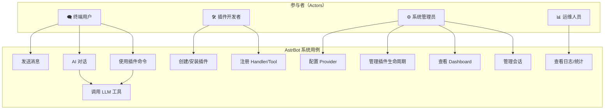

### 7.2 插件生命周期状态机

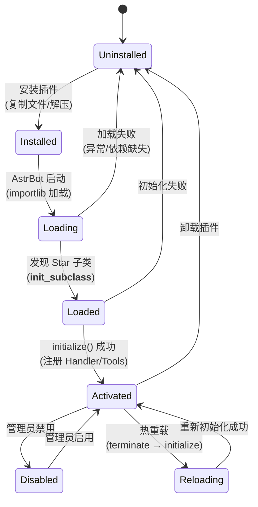

### 7.3 Agent 内部状态机

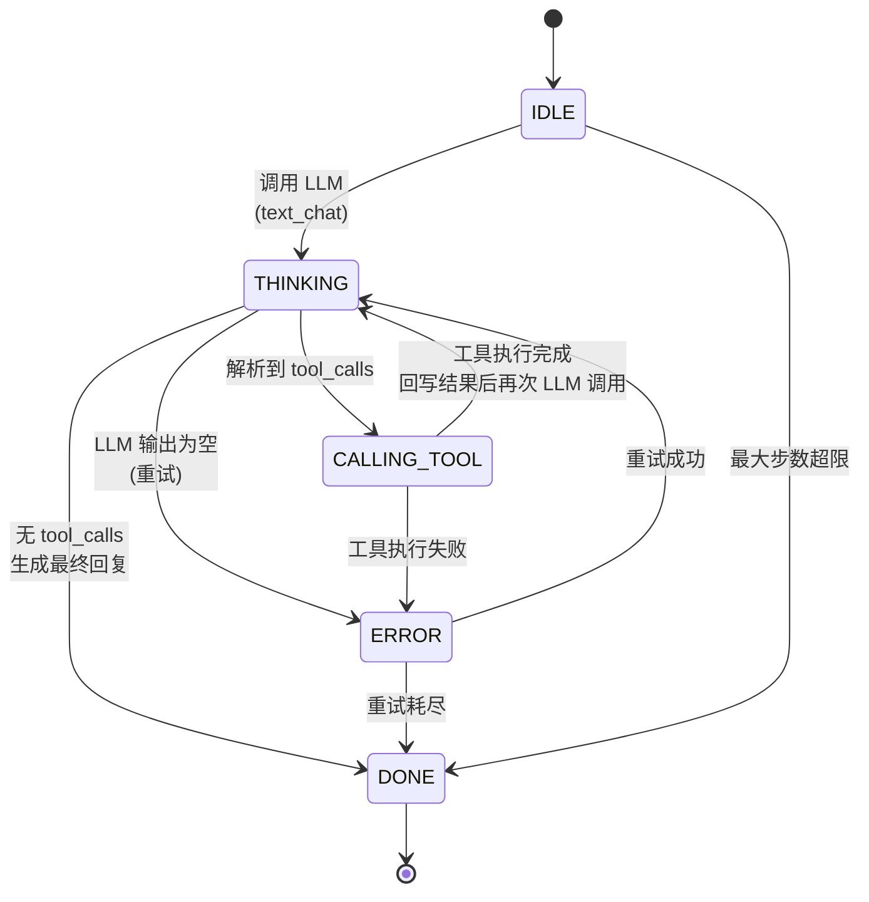

### 7.4 部署架构图

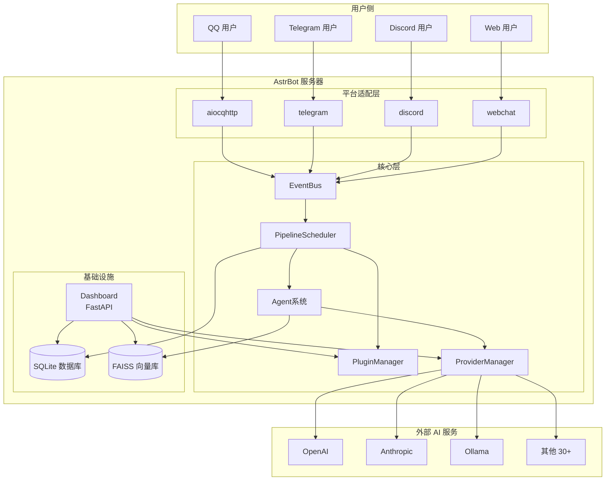

### 7.5 模块依赖矩阵

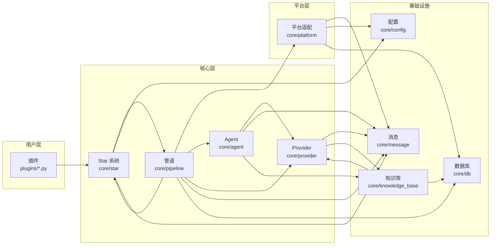

---

## 八、文件索引与代码地图

### 8.1 顶层结构

```
astrbot/
├── api/                    # 公共 API（供插件导入）
│   ├── event/             # 事件与过滤器 API
│   ├── platform/          # 平台事件 API
│   ├── provider/          # Provider API
│   ├── star/              # Star 基类 API
│   ├── util/              # 工具函数 API
│   ├── message_components.py  # 消息组件
│   └── web.py             # Web 辅助
├── builtin_stars/          # 内置插件
│   ├── astrbot/           # 主功能（群聊上下文等）
│   └── builtin_commands/  # 内置命令（help/admin 等）
├── cli/                    # 命令行工具
│   ├── commands/          # CLI 子命令
│   └── utils/             # CLI 工具
├── core/                   # 核心框架
│   ├── agent/             # Agent 系统
│   ├── backup/            # 备份系统
│   ├── computer/          # 计算机使用
│   ├── config/            # 配置管理
│   ├── cron/              # 定时任务
│   ├── db/                # 数据库
│   ├── knowledge_base/    # 知识库
│   ├── message/           # 消息组件
│   ├── pipeline/          # 消息管道
│   ├── platform/          # 平台适配
│   ├── provider/          # Provider 体系
│   ├── skills/            # 技能系统
│   ├── star/              # Star 插件系统
│   ├── tools/             # 内置工具
│   └── *.py               # 顶层核心模块
└── __init__.py
```

### 8.2 `api/` — 公共 API 层

| 文件 | 职责 | 核心类/函数 |
|------|------|------------|
| `api/__init__.py` | 公共 API 导出 | 导出 star/event/provider/platform 子模块 |
| `api/all.py` | 完整 API 导出 | 一次性导入所有 API |
| `api/message_components.py` | 消息组件类 | `Plain`, `At`, `Image`, `Record`, `Video`, `Reply`, `Node`, `Markdown`, `Json`, `CQCode` |
| `api/web.py` | Web 辅助工具 | 网页相关工具函数 |
| `api/star/__init__.py` | Star 基类导出 | `Star`, `Context`, `register` |
| `api/event/__init__.py` | 事件导出 | `AstrMessageEvent`, `EventType` |
| `api/event/filter/__init__.py` | 过滤器装饰器 | `filter.command()`, `filter.regex()`, `filter.permission()` |
| `api/provider/__init__.py` | Provider 导出 | `Provider`, `STTProvider`, `TTSProvider`, `EmbeddingProvider`, `RerankProvider` |
| `api/platform/__init__.py` | 平台事件导出 | `MessageType` |

### 8.3 `core/pipeline/` — 消息管道

| 文件 | 职责 | 核心类/函数 |
|------|------|------------|
| `pipeline/__init__.py` | 包入口 | — |
| `pipeline/stage.py` | Stage 基类 + 注册表 | `Stage`, `register_stage`, `registered_stages` |
| `pipeline/stage_order.py` | Stage 执行顺序 | `STAGES_ORDER` (9 个 Stage 名称列表) |
| `pipeline/bootstrap.py` | Stage 自动加载 | `ensure_builtin_stages_registered()` |
| `pipeline/context.py` | 管道上下文 | `PipelineContext` |
| `pipeline/context_utils.py` | 上下文工具 | `call_event_hook()`, `call_handler()` |
| `pipeline/scheduler.py` | 管道调度器 | `PipelineScheduler` |
| `pipeline/waking_check/stage.py` | Stage 1: 唤醒检查 | `WakingCheckStage` |
| `pipeline/whitelist_check/stage.py` | Stage 2: 白名单检查 | `WhitelistCheckStage` |
| `pipeline/session_status_check/stage.py` | Stage 3: 会话状态 | `SessionStatusCheckStage` |
| `pipeline/rate_limit_check/stage.py` | Stage 4: 频率限制 | `RateLimitStage` |
| `pipeline/content_safety_check/stage.py` | Stage 5: 内容安全 | `ContentSafetyCheckStage` |
| `pipeline/content_safety_check/strategies/` | 安全策略 | `InternalKeywordsStrategy`, `BaiduAIPStrategy` |
| `pipeline/preprocess_stage/stage.py` | Stage 6: 预处理 | `PreProcessStage` |
| `pipeline/process_stage/stage.py` | Stage 7: 核心处理 | `ProcessStage` |
| `pipeline/process_stage/method/star_request.py` | 插件子阶段 | `StarRequestSubStage` |
| `pipeline/process_stage/method/agent_request.py` | Agent 子阶段入口 | `AgentRequestSubStage` |
| `pipeline/process_stage/method/agent_sub_stages/internal.py` | 本地 Agent 子阶段 | `InternalAgentSubStage` |
| `pipeline/process_stage/method/agent_sub_stages/third_party.py` | 第三方 Agent 子阶段 | `ThirdPartyAgentSubStage` |
| `pipeline/process_stage/follow_up.py` | 跟进机制 | `FollowUpCapture`, `try_capture_follow_up()` |
| `pipeline/result_decorate/stage.py` | Stage 8: 结果装饰 | `ResultDecorateStage` |
| `pipeline/respond/stage.py` | Stage 9: 发送消息 | `RespondStage` |

### 8.4 `core/star/` — 插件系统

| 文件 | 职责 | 核心类/函数 |
|------|------|------------|
| `star/__init__.py` | 包入口 | 导出 Star 相关类 |
| `star/base.py` | Star 基类 | `Star` (含 `__init_subclass__` 自动注册) |
| `star/star.py` | 插件元数据 | `StarMetadata`, `star_map`, `star_registry` |
| `star/context.py` | 插件上下文 | `Context` (受控 API) |
| `star/star_handler.py` | Handler 元数据与注册表 | `StarHandlerMetadata`, `StarHandlerRegistry` |
| `star/star_manager.py` | 插件管理器 | `PluginManager` (加载/卸载/热重载) |
| `star/star_tools.py` | 插件工具管理 | 工具注册与执行 |
| `star/filter/__init__.py` | 过滤器基类 | `HandlerFilter` |
| `star/filter/command.py` | 命令过滤器 | `CommandFilter` |
| `star/filter/command_group.py` | 命令分组 | `CommandGroupFilter` |
| `star/filter/regex.py` | 正则过滤器 | `RegexFilter` |
| `star/filter/permission.py` | 权限过滤器 | `PermissionFilter` |
| `star/filter/event_message_type.py` | 消息类型过滤 | `EventMessageTypeFilter` |
| `star/filter/platform_adapter_type.py` | 平台过滤 | `PlatformAdapterTypeFilter` |
| `star/filter/custom_filter.py` | 自定义过滤器 | `CustomHandlerFilter` |
| `star/register/star.py` | Star 注册装饰器 | `@register()` |
| `star/register/star_handler.py` | Handler 注册装饰器 | `@filter.command()` 等 |
| `star/session_plugin_manager.py` | 会话级插件管理 | `SessionPluginManager` |
| `star/session_llm_manager.py` | 会话级 LLM 管理 | `SessionLLMManager` |
| `star/command_management.py` | 命令管理 | `CommandManagement` |
| `star/config.py` | 插件配置 | 插件配置读写 |
| `star/updator.py` | 插件更新 | 插件版本检查与更新 |
| `star/error_messages.py` | 错误消息 | 统一的错误消息模板 |

### 8.5 `core/agent/` — Agent 系统

| 文件 | 职责 | 核心类/函数 |
|------|------|------------|
| `agent/__init__.py` | 包入口 | — |
| `agent/agent.py` | Agent 基类 | `Agent` 抽象基类 |
| `agent/message.py` | Agent 消息 | `Message`, `ContentPart`, `TextPart`, `ThinkPart`, `ToolCall` |
| `agent/response.py` | Agent 响应 | `AgentResponseData`, `AgentStats` |
| `agent/run_context.py` | 运行上下文 | `AgentRunContext` |
| `agent/hooks.py` | Agent 钩子 | `BaseAgentRunHooks` |
| `agent/tool.py` | 工具定义 | `ToolSchema`, `FunctionTool`, `ToolSet` |
| `agent/tool_executor.py` | 工具执行器 | `ToolExecutor` |
| `agent/tool_image_cache.py` | 工具图片缓存 | `tool_image_cache` |
| `agent/handoff.py` | Agent 交接 | `HandoffManager` |
| `agent/mcp_client.py` | MCP 客户端 | `MCPClient` |
| `agent/runners/tool_loop_agent_runner.py` | ReAct 循环 Agent | `ToolLoopAgentRunner` (核心) |
| `agent/runners/base.py` | Runner 基类 | `BaseAgentRunner` |
| `agent/runners/coze/` | 扣子 AI Runner | `CozeAgentRunner`, `CozeAPIClient` |
| `agent/runners/dashscope/` | 阿里百炼 Runner | `DashScopeAgentRunner` |
| `agent/runners/deerflow/` | DeerFlow Runner | `DeerFlowAgentRunner`, `DeerFlowAPIClient` |
| `agent/runners/dify/` | Dify Runner | `DifyAgentRunner`, `DifyAPIClient` |
| `agent/context/manager.py` | 上下文管理器 | `ContextManager` |
| `agent/context/compressor.py` | 上下文压缩 | `ContextCompressor` |
| `agent/context/truncator.py` | 上下文截断 | `Truncator` |
| `agent/context/token_counter.py` | Token 计数 | `TokenCounter`, `EstimateTokenCounter` |
| `agent/context/config.py` | 上下文配置 | `ContextConfig` |
| `agent/context/round_utils.py` | 回合工具 | `round_utils` 辅助函数 |

### 8.6 `core/provider/` — Provider 体系

| 文件 | 职责 | 核心类/函数 |
|------|------|------------|
| `provider/__init__.py` | 包入口 | — |
| `provider/provider.py` | Provider 基类 | `AbstractProvider`, `Provider`, `STTProvider`, `TTSProvider`, `EmbeddingProvider`, `RerankProvider` |
| `provider/register.py` | Provider 注册 | `register_provider_adapter()`, `provider_registry`, `provider_cls_map` |
| `provider/entities.py` | Provider 实体 | `ProviderRequest`, `LLMResponse`, `ToolCallsResult`, `ToolCallMessageSegment` |
| `provider/entites.py` | Provider 实体（旧版） | 兼容层 |
| `provider/modalities.py` | 模态处理 | `sanitize_contexts_by_modalities()` |
| `provider/manager.py` | Provider 管理器 | `ProviderManager` |
| `provider/func_tool_manager.py` | 函数工具管理 | `FunctionToolManager` |
| `provider/sources/` | 40+ 适配器 | 详见附录 C |

### 8.7 `core/platform/` — 平台适配

| 文件 | 职责 | 核心类/函数 |
|------|------|------------|
| `platform/__init__.py` | 包入口 | — |
| `platform/platform.py` | Platform 基类 | `Platform` |
| `platform/astr_message_event.py` | 消息事件基类 | `AstrMessageEvent` |
| `platform/astrbot_message.py` | AstrBot 消息 | AstrBot 消息封装 |
| `platform/message_session.py` | 消息会话 | 会话管理 |
| `platform/message_type.py` | 消息类型 | `MessageType` 枚举 |
| `platform/register.py` | 平台注册 | `register_platform_adapter()` |
| `platform/platform_metadata.py` | 平台元数据 | `PlatformMetaData` |
| `platform/manager.py` | 平台管理器 | `PlatformManager` |
| `platform/webhook_server.py` | Webhook 服务 | `WebhookServer` |
| `platform/sources/` | 17+ 平台适配器 | 详见附录 D |

### 8.8 `core/` 顶层模块

| 文件 | 职责 | 核心类/函数 |
|------|------|------------|
| `__init__.py` | 包入口 | `logger` 导出 |
| `astrbot_config_mgr.py` | AstrBot 配置管理 | `AstrBotConfigManager` |
| `initial_loader.py` | 初始化加载 | 启动时的初始化逻辑 |
| `core_lifecycle.py` | 核心生命周期 | 启动/停止生命周期管理 |
| `event_bus.py` | 事件总线 | `EventBus` |
| `astr_main_agent.py` | 主 Agent 构建 | 主 Agent 组装逻辑 |
| `astr_agent_context.py` | Agent 上下文封装 | Agent 上下文构造 |
| `astr_agent_hooks.py` | Agent 钩子封装 | Agent 钩子组装 |
| `astr_agent_run_util.py` | Agent 运行工具 | Agent 运行辅助函数 |
| `astr_agent_tool_exec.py` | Agent 工具执行封装 | 工具执行辅助 |
| `astr_main_agent_resources.py` | Agent 资源 | Agent 资源组装 |
| `conversation_mgr.py` | 对话管理 | `ConversationManager` |
| `platform_message_history_mgr.py` | 平台消息历史 | 消息历史记录 |
| `persona_mgr.py` | Persona 管理 | Persona 角色管理 |
| `persona_error_reply.py` | Persona 错误回复 | 错误回复模板 |
| `file_token_service.py` | 文件 Token 服务 | 文件临时访问 Token |
| `desktop_runtime.py` | 桌面运行时 | 桌面环境适配 |
| `exceptions.py` | 异常定义 | AstrBot 专用异常类 |
| `sentinels.py` | 哨兵值 | 特殊哨兵值定义 |
| `log.py` | 日志系统 | 日志配置与工具 |
| `updator.py` | 更新检查 | AstrBot 版本更新检查 |

---

## 九、安全分析

### 9.1 攻击面识别

| 攻击面 | 风险等级 | 说明 |
|--------|---------|------|
| **插件代码注入** | 🔴 高 | 第三方插件以 AstrBot 权限执行任意代码 |
| **Provider API Key 泄露** | 🔴 高 | 配置中的 API Key 可能被恶意插件读取 |
| **工具调用滥用** | 🟡 中 | LLM 可能被诱导执行危险工具调用 |
| **路径穿越** | 🟡 中 | 文件操作可能被利用访问系统文件 |
| **会话劫持** | 🟡 中 | 伪造消息来源身份可能绕过权限检查 |
| **Rate Limit 绕过** | 🟢 低 | 通过多平台/多账号规避频率限制 |
| **平台协议漏洞** | 🟢 低 | 各 IM 平台协议本身的安全漏洞 |

### 9.2 现有防护机制

| 防护层 | 机制 | 位置 |
|--------|------|------|
| **代码隔离** | 插件在独立进程/命名空间中加载 | `PluginManager` |
| **权限控制** | 管理员/成员两级权限 | `PermissionFilter`, `WakingCheckStage` |
| **内容安全** | 关键词 + 百度 AI 双重检查 | `ContentSafetyCheckStage` |
| **API Key 保护** | Provider 配置存储在 JSON 中 | `astrbot_config.json` |
| **会话锁** | 防止并发请求冲突 | `session_lock_manager` |
| **请求重试** | 避免 API 异常导致的资源耗尽 | `request_max_retries` |
| **工具白名单** | 只有注册的工具可被 LLM 调用 | `ToolSet` |
| **最大步数限制** | 防止 Agent 无限循环 | `max_agent_step` (默认 30) |
| **Computer Use 隔离** | 沙箱运行时执行代码 | `core/computer/booters/` |

### 9.3 安全风险与改进建议

| 风险 | 严重程度 | 改进建议 |
|------|---------|---------|
| 插件可读取任意配置 | 🔴 | Context API 应限制插件可访问的配置范围 |
| LLM 输出未经验证即执行 | 🔴 | 工具调用前增加参数校验和沙箱执行 |
| API Key 明文存储 | 🟡 | 支持环境变量和加密存储 |
| 缺少插件签名验证 | 🟡 | 增加插件签名机制，验证来源可信度 |
| 无速率限制 Dashboard API | 🟡 | 为 Dashboard API 添加速率限制 |
| 错误信息泄露内部路径 | 🟢 | 生产环境关闭详细错误堆栈 |

### 9.4 插件安全沙箱建议

```
建议实现：
1. 插件进程隔离（subprocess 或 sandbox）
2. 插件文件系统权限限制（只允许访问 data/plugins/<plugin_name>/）
3. 插件网络访问白名单
4. 插件内存/CPU 资源限制
5. 插件 API 调用配额
```

---

## 十、测试策略分析

### 10.1 测试金字塔

```
                    ┌───────────────┐
                    │  E2E 测试     │ ← 少量，覆盖核心流程
                    │ (端到端)      │   如：消息→LLM→回复完整链路
                    ├───────────────┤
                    │  集成测试     │ ← 中等数量
                    │ (模块集成)    │   如：Pipeline 各 Stage 集成
                    ├───────────────┤
                    │  单元测试     │ ← 大量，覆盖所有核心类
                    │ (函数/类级)   │   如：每个 Stage、每个 Provider
                    └───────────────┘
```

### 10.2 关键测试点

| 模块 | 测试类型 | 关键测试场景 |
|------|---------|-------------|
| **Stage 管道** | 单元测试 | 每个 Stage 的 process() 方法；洋葱模型递归正确性 |
| **Stage 管道** | 集成测试 | 完整 9-Stage 管道；stop_event() 传播 |
| **Agent** | 单元测试 | ReAct 循环终止条件；重复工具检测；Token 压缩 |
| **Agent** | 集成测试 | 工具调用 → 结果回写 → 再次 LLM 调用 |
| **Provider** | 单元测试 | 每个 Provider 的 mock 测试；流式/非流式响应 |
| **Provider** | 集成测试 | Provider 请求 → 响应完整链路 |
| **Platform** | 单元测试 | 消息事件解析；平台协议适配 |
| **插件系统** | 单元测试 | 插件加载/卸载/热重载；Handler 注册/注销 |
| **插件系统** | 集成测试 | 插件 Handler 被 Pipeline 正确触发 |
| **事件总线** | 单元测试 | 事件队列 dispatch；异常处理不影响主循环 |
| **内容安全** | 单元测试 | 关键词过滤；百度 AI 策略 |
| **频率限制** | 单元测试 | Fixed Window 算法；STALL/DISCARD 策略 |
| **数据库** | 单元测试 | CRUD 操作；迁移脚本 |

### 10.3 Mock 策略

```
Pipeline 测试：
- Mock: PipelineContext, AstrMessageEvent, AstrBotConfig
- Spy: Stage.process() 调用顺序

Agent 测试：
- Mock: Provider (text_chat, text_chat_stream), ToolExecutor
- Fake: ToolSet (返回预定义的工具列表)

Provider 测试：
- Mock: HTTP 客户端 (aiohttp, httpx)
- Fake: 返回预设的 LLM 响应

Platform 测试：
- Mock: 平台 WebSocket/HTTP 连接
- Fake: 返回预设的平台消息事件
```

### 10.4 测试覆盖率建议

| 模块 | 目标覆盖率 | 优先级 |
|------|-----------|--------|
| `core/pipeline/` | 85% | 🔴 高 |
| `core/agent/` | 80% | 🔴 高 |
| `core/provider/` | 70% | 🟡 中 |
| `core/star/` | 75% | 🔴 高 |
| `core/platform/` | 60% | 🟡 中 |
| `core/db/` | 80% | 🟡 中 |
| `core/config/` | 70% | 🟢 低 |

---

## 十一、技术债务清单

### 11.1 高优先级

| # | 债务 | 文件 | 影响 | 建议 |
|---|------|------|------|------|
| 1 | `astr_main_agent.py` 超大文件 | `core/astr_main_agent.py` | 可维护性 | 拆分为多个小模块 |
| 2 | 部分 Provider 大量使用 `Any` | `core/provider/sources/*.py` | 类型安全 | 收紧类型约束 |
| 3 | 错误处理不统一 | 多个模块 | 可维护性 | 建立统一异常体系 |
| 4 | `entites.py` vs `entities.py` 拼写错误 | `core/provider/` | 代码整洁 | 合并到 `entities.py` |
| 5 | 缺少插件 API 版本号 | 全局 | 兼容性 | Context 中加入 API_VERSION |

### 11.2 中优先级

| # | 债务 | 文件 | 影响 | 建议 |
|---|------|------|------|------|
| 6 | Provider 适配器代码重复 | `core/provider/sources/` | 可维护性 | 抽取公共基类 |
| 7 | 平台适配器代码重复 | `core/platform/sources/` | 可维护性 | 抽取公共基类 |
| 8 | 配置项分散 | `core/config/`, `core/pipeline/` | 可维护性 | 集中到默认配置 |
| 9 | 魔法数字 | `core/agent/runners/` | 可读性 | 定义为命名常量 |
| 10 | 日志配置硬编码 | `core/log.py` | 灵活性 | 支持配置文件覆盖 |

### 11.3 低优先级

| # | 债务 | 文件 | 影响 | 建议 |
|---|------|------|------|------|
| 11 | 部分文档字符串缺失 | 多个模块 | 可维护性 | 补充 docstring |
| 12 | 缺少类型注解的 `Any` | 散布各处 | 类型安全 | 逐步补充类型 |
| 13 | import 顺序不统一 | 多个模块 | 代码风格 | 统一排序（stdlib→third-party→local） |

---

## 十二、版本演进与兼容性

### 12.1 版本演进路线

```
v1.x → v2.x → v3.x → v4.x（当前）
  │       │       │        │
  │       │       │        ├── Pipeline 管道架构成熟
  │       │       │        ├── Star 插件系统稳定
  │       │       │        ├── Agent ReAct 循环
  │       │       │        └── Provider 体系完善
  │       │       │
  │       │       └── 引入 Agent 系统、工具调用
  │       │
  │       └── 引入管道-过滤器架构
  │
  └── 基础版本，简单的消息处理
```

### 12.2 API 兼容性策略

| 策略 | 说明 |
|------|------|
| **语义化版本** | 主版本号变更意味着 Breaking Change |
| **弃用周期** | 旧 API 至少保留一个主版本周期 |
| **适配器层** | `entites.py` 作为旧版 `entities.py` 的兼容层 |
| **配置迁移** | `core/db/migration/` 提供数据库迁移脚本 |
| **向后兼容** | Provider 配置格式保持向后兼容 |

### 12.3 插件兼容性

- 插件通过 `api/` 公共层与核心交互，核心内部变更不影响插件
- `@register` 装饰器向后兼容
- `Context` API 遵循增量扩展原则，不删除已有方法

---

## 十三、性能基准与优化建议

### 13.1 关键性能指标

| 指标 | 目标值 | 说明 |
|------|--------|------|
| 消息处理延迟（p95） | < 500ms | 从收到消息到开始 LLM 调用 |
| 首 Token 延迟（流式） | < 2s | 从 LLM 调用到收到首个 Token |
| Pipeline 吞吐量 | > 100 msg/s | 单实例同时处理消息数 |
| Agent 单步耗时 | < 30s | 单次工具调用 + LLM 响应 |
| 并发会话数 | > 50 | 同时活跃的会话数 |
| 内存占用 | < 500MB | 基础运行时内存 |

### 13.2 性能瓶颈识别

| 瓶颈 | 位置 | 原因 | 优化建议 |
|------|------|------|---------|
| LLM API 延迟 | Provider 层 | 网络 + API 响应时间 | 流式响应、备用 Provider |
| Embedding 批量延迟 | `EmbeddingProvider` | 大批量串行处理 | 分批并行处理 |
| 数据库查询 | `ConversationManager` | 每次对话查询历史 | 内存缓存 + 批量写入 |
| 插件 Handler 调用 | `call_handler()` | 多 Handler 串行调用 | 并行执行（需评估顺序依赖） |
| Token 估算 | `EstimateTokenCounter` | 长文本估算不准 | 渐进式精确计算 |

### 13.3 性能优化建议

| # | 优化方向 | 预期收益 | 复杂度 |
|---|---------|---------|--------|
| 1 | Pipeline 预热：启动时预加载所有 Stage | 减少首次请求延迟 30-50% | 低 |
| 2 | 对话历史缓存：LRU 缓存最近 N 个会话的历史 | 减少 DB 查询 80%+ | 中 |
| 3 | Handler 并行：无顺序依赖的 Handler 并行执行 | 提升吞吐量 20-50% | 中 |
| 4 | Provider 连接池：HTTP keep-alive + 连接复用 | 减少连接建立时间 | 低 |
| 5 | 消息组件延迟解析：按需解析消息组件 | 减少 CPU 开销 | 低 |
| 6 | FAISS 索引预加载：启动时加载向量索引到内存 | 减少首次检索延迟 | 中 |

---

## 十四、工程实践亮点与可改进点

### 14.1 十大亮点

| # | 亮点 | 技术深度 | 影响范围 |
|---|------|---------|---------|
| 1 | **洋葱模型实现** | 利用 `AsyncGenerator` 优雅实现中间件模式 | Pipeline 全局 |
| 2 | **自动注册机制** | `__init_subclass__` + 装饰器实现零配置注册 | 插件/Provider/Stage |
| 3 | **ReAct Agent 循环** | 完整的工具调用循环，支持 Skills-like 双阶段模式 | Agent 系统 |
| 4 | **多 Provider 抽象** | 5 种基类 + 40+ 适配器，抽象层次清晰 | AI 能力层 |
| 5 | **ProviderRequest/LLMResponse** | 数据类契约隔离上层与具体实现 | Pipeline↔Agent↔Provider |
| 6 | **会话级并发控制** | `session_lock_manager` 防止同会话并发冲突 | Agent 系统 |
| 7 | **Follow-up 跟进机制** | 智能捕获并发消息并排队处理 | Pipeline |
| 8 | **多级重试与降级** | 空输出重试→备用 Provider→最大步数终止 | Agent+Provider |
| 9 | **统一消息链** | `MessageChain` 封装所有消息组件 | 全局 |
| 10 | **Dashboard 一体化** | 实时监控+配置+插件管理+日志 | 运维 |

### 14.2 可改进点

| # | 改进方向 | 优先级 | 预期收益 |
|---|---------|--------|---------|
| 1 | 补充大规模单元测试 | 🔴 | 质量保障 |
| 2 | 拆分超大文件（如 `astr_main_agent.py`） | 🔴 | 可维护性 |
| 3 | 配置中心化管理 | 🟡 | 可维护性 |
| 4 | 类型安全增强 | 🟡 | 代码质量 |
| 5 | 错误处理标准化 | 🟡 | 可维护性 |
| 6 | 插件 API 版本号 | 🟡 | 兼容性 |
| 7 | 性能基准测试 | 🟢 | 性能保障 |
| 8 | 文档字符串补充 | 🟢 | 可维护性 |

### 14.3 设计权衡总结

| 权衡维度 | 选择 | 代价 |
|---------|------|------|
| **扩展性 vs 复杂度** | 选择高扩展性（多 Provider、多平台、插件化） | 增加了抽象层次，理解成本上升 |
| **性能 vs 可靠性** | 选择异步并发 + 多层重试 | 引入了会话锁、状态管理等复杂度 |
| **通用性 vs 特异性** | 统一接口（5 种 Provider 基类） | 某些 Provider 的特有能力无法暴露 |
| **零配置 vs 可控性** | 自动注册 + 装饰器 | 调试时不易发现注册问题 |
| **实时性 vs 有序性** | 事件驱动异步调度 | 消息处理顺序不完全可控 |
| **安全 vs 便利性** | Context 受控 API + 插件隔离 | 插件开发者需理解 Context 限制 |

---

## 十五、总结与工程启示

### 15.1 AstrBot 的工程哲学

通过软件工程视角分析，AstrBot 展现了以下核心工程哲学：

1. **开放封闭原则（OCP）**：通过插件系统、Provider 适配器、平台适配器、Stage 可插拔等机制，对扩展开放，对修改封闭。

2. **依赖倒置原则（DIP）**：高层模块（Pipeline、Agent）依赖抽象（`Provider`、`Platform`、`Stage`），而非具体实现。

3. **接口隔离原则（ISP）**：5 种 Provider 各司其职，`Context` 只暴露必要接口。

4. **单一职责原则（SRP）**：每个 Stage 只负责一件事，每个 Provider 只对接一个 AI 服务。

5. **里氏替换原则（LSP）**：任何 Provider 实现可替换基类，任何平台适配器可替换基类。

6. **迪米特法则（LoD）**：插件通过事件钩子间接通信，减少对象间的直接依赖。

### 15.2 对开发者的启示

| 启示 | 说明 |
|------|------|
| **分层与抽象** | 大型系统必须通过抽象层隔离变化。AstrBot 通过 Provider 抽象层隔离了 AI 服务的多样性，通过 Platform 抽象层隔离了 IM 平台的多样性。 |
| **数据契约优先** | 模块间通过数据类（dataclass）定义稳定的契约（`ProviderRequest`、`LLMResponse`），而非直接传递复杂对象。 |
| **中间件模式的威力** | 洋葱模型/中间件模式是处理"可插拔处理链"的最佳实践，通过 `yield` 巧妙实现了前置/后置逻辑的解耦。 |
| **声明式编程** | 装饰器（`@register`、`@filter.command`）将注册逻辑与业务逻辑分离，让开发者专注于功能实现。 |
| **异步并发设计** | `asyncio` + `async/await` + `AsyncGenerator` 的组合为高并发 I/O 密集型应用提供了优雅的解决方案。 |
| **渐进式扩展** | 从最小核心（Core）出发，通过插件、适配器、工具等机制逐步扩展能力，避免"大而全"的初始设计。 |
| **自动注册** | 利用 Python 的元类特性（`__init_subclass__`）实现零配置注册，大幅降低扩展成本。 |
| **多级降级** | 从空输出重试到 fallback providers，多层次的降级策略显著提升了可靠性。 |

### 15.3 最终定位

AstrBot 是一个**工程化程度很高的 AI 聊天机器人框架**，其架构设计综合了管道-过滤器、微内核、事件驱动三种经典架构风格，并通过精心运用策略、观察者、适配器、装饰器、工厂方法等 9+ 种设计模式，实现了良好的可扩展性、可维护性和可靠性。

对学习 AI Agent 框架、聊天机器人开发、以及大型 Python 项目架构设计的开发者来说，AstrBot 是一个非常优秀的参考案例。

---

## 附录 A：完整文件索引

### A.1 `core/db/` — 数据库

| 文件 | 职责 |
|------|------|
| `db/__init__.py` | 包入口 |
| `db/sqlite.py` | SQLite 数据库操作 |
| `db/po.py` | 持久化对象定义 |
| `db/vec_db/base.py` | 向量数据库基类 |
| `db/vec_db/faiss_impl/vec_db.py` | FAISS 向量库实现 |
| `db/vec_db/faiss_impl/document_storage.py` | 文档存储 |
| `db/vec_db/faiss_impl/embedding_storage.py` | 向量存储 |
| `db/migration/sqlite_v3.py` | SQLite v3 建表 |
| `db/migration/helper.py` | 迁移辅助函数 |
| `db/migration/migra_3_to_4.py` | v3→v4 迁移 |
| `db/migration/migra_45_to_46.py` | v4.5→v4.6 迁移 |
| `db/migration/migra_token_usage.py` | Token 用量表迁移 |
| `db/migration/migra_webchat_session.py` | WebChat 会话迁移 |
| `db/migration/shared_preferences_v3.py` | 共享偏好设置迁移 |

### A.2 `core/config/` — 配置

| 文件 | 职责 |
|------|------|
| `config/__init__.py` | 包入口 |
| `config/astrbot_config.py` | AstrBotConfig 类 |
| `config/default.py` | 默认配置值 |
| `config/i18n_utils.py` | 国际化工具 |

### A.3 `core/message/` — 消息

| 文件 | 职责 |
|------|------|
| `message/__init__.py` | 包入口 |
| `message/components.py` | 消息组件类（Plain, At, Image, Record 等） |
| `message/message_event_result.py` | 消息事件结果（MessageChain） |

### A.4 `core/knowledge_base/` — 知识库

| 文件 | 职责 |
|------|------|
| `knowledge_base/kb_mgr.py` | 知识库管理器 |
| `knowledge_base/kb_helper.py` | 知识库辅助函数 |
| `knowledge_base/kb_db_sqlite.py` | 知识库 SQLite |
| `knowledge_base/models.py` | 数据模型 |
| `knowledge_base/prompts.py` | 知识库相关 Prompt |
| `knowledge_base/chunking/base.py` | 分块基类 |
| `knowledge_base/chunking/fixed_size.py` | 固定大小分块 |
| `knowledge_base/chunking/markdown.py` | Markdown 感知分块 |
| `knowledge_base/chunking/recursive.py` | 递归分块 |
| `knowledge_base/parsers/base.py` | 解析器基类 |
| `knowledge_base/parsers/pdf_parser.py` | PDF 解析 |
| `knowledge_base/parsers/epub_parser.py` | EPUB 解析 |
| `knowledge_base/parsers/markitdown_parser.py` | 通用解析 |
| `knowledge_base/parsers/text_parser.py` | 文本解析 |
| `knowledge_base/parsers/url_parser.py` | URL 解析 |
| `knowledge_base/retrieval/manager.py` | 检索管理器 |
| `knowledge_base/retrieval/rank_fusion.py` | 融合排序 |
| `knowledge_base/retrieval/sparse_retriever.py` | 稀疏检索 |
| `knowledge_base/retrieval/tokenizer.py` | 分词器 |

### A.5 `core/tools/` — 内置工具

| 文件 | 职责 |
|------|------|
| `tools/registry.py` | 工具注册表 |
| `tools/message_tools.py` | 消息工具（send_message, get_session_info） |
| `tools/web_search_tools.py` | 搜索工具（web_search, web_fetch） |
| `tools/knowledge_base_tools.py` | 知识库工具（kb_search） |
| `tools/cron_tools.py` | 定时任务工具 |
| `tools/computer_tools/cua.py` | 计算机使用工具 |
| `tools/computer_tools/fs.py` | 文件系统工具 |
| `tools/computer_tools/python.py` | Python 执行工具 |
| `tools/computer_tools/shell.py` | Shell 执行工具 |
| `tools/computer_tools/util.py` | 计算机工具辅助 |
| `tools/computer_tools/shipyard_neo/` | Shipyard Neo 工具 |

### A.6 `core/computer/` — 计算机使用

| 文件 | 职责 |
|------|------|
| `computer/computer_client.py` | 计算机客户端 |
| `computer/file_read_utils.py` | 文件读取工具 |
| `computer/booters/base.py` | Booter 基类 |
| `computer/booters/local.py` | 本地 Booter |
| `computer/booters/sandbox.py` | 沙箱 Booter |
| `computer/booters/cua.py` | CUA Booter |
| `computer/booters/shipyard.py` | Shipyard Booter |
| `computer/booters/shipyard_neo.py` | Shipyard Neo Booter |
| `computer/booters/bay_manager.py` | Bay 管理器 |
| `computer/booters/shell_background.py` | Shell 后台 |
| `computer/olayer/browser.py` | 浏览器操作 |
| `computer/olayer/filesystem.py` | 文件系统操作 |
| `computer/olayer/gui.py` | GUI 操作 |
| `computer/olayer/python.py` | Python 执行 |
| `computer/olayer/shell.py` | Shell 执行 |

### A.7 `core/backup/` — 备份

| 文件 | 职责 |
|------|------|
| `backup/__init__.py` | 包入口 |
| `backup/constants.py` | 常量定义 |
| `backup/exporter.py` | 备份导出 |
| `backup/importer.py` | 备份导入 |

### A.8 `core/skills/` — 技能

| 文件 | 职责 |
|------|------|
| `skills/__init__.py` | 包入口 |
| `skills/skill_manager.py` | 技能管理器 |
| `skills/neo_skill_sync.py` | Neo 技能同步 |

### A.9 `core/cron/` — 定时任务

| 文件 | 职责 |
|------|------|
| `cron/__init__.py` | 包入口 |
| `cron/events.py` | 定时任务事件 |
| `cron/manager.py` | 定时任务管理器 |

---

## 附录 B：核心配置项速查

### B.1 基础配置

| 配置项 | 类型 | 默认值 | 说明 |
|--------|------|--------|------|
| `prefix` | string | `"/"` | 命令前缀 |
| `wake_prefix` | string | `""` | 唤醒前缀 |
| `unified_msg_origin` | string | `"default"` | 统一消息来源标识 |
| `enable_llm` | bool | `true` | 启用 LLM |
| `streaming_response` | bool | `true` | 流式响应 |

### B.2 Agent 配置

| 配置项 | 类型 | 默认值 | 说明 |
|--------|------|--------|------|
| `max_agent_step` | int | `30` | 最大 Agent 步骤 |
| `tool_call_timeout` | int | `120` | 工具调用超时（秒） |
| `tool_schema_mode` | string | `"full"` | 工具 Schema 模式 |
| `context_limit_reached_strategy` | string | `"llm_compress"` | 上下文超限策略 |
| `max_context_length` | int | `-1` | 最大上下文长度（-1=无限） |
| `computer_use_runtime` | string | `"none"` | 计算机使用运行时 |

### B.3 安全配置

| 配置项 | 类型 | 默认值 | 说明 |
|--------|------|--------|------|
| `enable_id_white_list` | bool | `false` | 启用 ID 白名单 |
| `id_whitelist` | list | `[]` | 白名单 ID 列表 |
| `content_safety` | dict | `{}` | 内容安全配置 |
| `rate_limit` | dict | `{}` | 频率限制配置 |

### B.4 回复配置

| 配置项 | 类型 | 默认值 | 说明 |
|--------|------|--------|------|
| `reply_prefix` | string | `""` | 回复前缀 |
| `segemented_reply` | bool | `false` | 分段回复 |
| `pre_ack_emoji` | list | `[]` | 预处理表情 |
| `t2i` | dict | `{}` | 文本转图片配置 |
| `tts` | dict | `{}` | 文本转语音配置 |

---

## 附录 C：Provider 适配器速查表

### C.1 Chat Providers

| 类型名 | 类名 | 文件 | 说明 |
|--------|------|------|------|
| `openai` | `OpenAISource` | `openai_source.py` | OpenAI 兼容 |
| `azure` | `AzureSource` | (azure 相关) | Azure OpenAI |
| `anthropic` | `AnthropicSource` | `anthropic_source.py` | Claude 系列 |
| `gemini` | `GeminiSource` | `gemini_source.py` | Google Gemini |
| `zhipu` | `ZhipuSource` | `zhipu_source.py` | 智谱 AI |
| `dashscope` | `DashScopeSource` | `dashscope` 相关 | 阿里百炼 |
| `volcengine` | `VolcengineSource` | `volcengine_source.py` | 火山引擎 |
| `xai` | `XAISource` | `xai_source.py` | X.AI |
| `ollama` | `OllamaSource` | `ollama` 相关 | Ollama 本地 |
| `groq` | `GroqSource` | `groq_source.py` | Groq |
| `openrouter` | `OpenRouterSource` | `openrouter_source.py` | OpenRouter |
| `kimi_code` | `KimiCodeSource` | `kimi_code_source.py` | Kimi Code |
| `longcat` | `LongCatSource` | `longcat_source.py` | LongCat |
| `xiaomi` | `XiaomiSource` | `xiaomi_source.py` | 小米 AI |
| `gsv_selfhosted` | `GSVSelfHostedSource` | `gsv_selfhosted_source.py` | 自托管 |

### C.2 TTS Providers

| 类型名 | 类名 | 文件 |
|--------|------|------|
| `edge_tts` | `EdgeTTSSource` | `edge_tts_source.py` |
| `azure_tts` | `AzureTTSSource` | `azure_tts_source.py` |
| `openai_tts` | `OpenAITTSSource` | `openai_tts_api_source.py` |
| `elevenlabs_tts` | `ElevenLabsTTSSource` | `elevenlabs_tts_source.py` |
| `fishaudio_tts` | `FishAudioTTSSource` | `fishaudio_tts_api_source.py` |
| `dashscope_tts` | `DashScopeTTSSource` | `dashscope_tts.py` |
| `volcengine_tts` | `VolcengineTTSSource` | `volcengine_tts.py` |
| `genie_tts` | `GenieTTSSource` | `genie_tts.py` |
| `mimo_tts` | `MIMOttsSource` | `mimo_tts_api_source.py` |
| `gsvi_tts` | `GSVITTSSource` | `gsvi_tts_source.py` |
| `minimax_tts` | `MiniMaxTTSSource` | `minimax_tts_api_source.py` |

### C.3 STT Providers

| 类型名 | 类名 | 文件 |
|--------|------|------|
| `whisper_api` | `WhisperAPISource` | `whisper_api_source.py` |
| `whisper_selfhosted` | `WhisperSelfHostedSource` | `whisper_selfhosted_source.py` |
| `sensevoice_selfhosted` | `SenseVoiceSelfHostedSource` | `sensevoice_selfhosted_source.py` |
| `mimo_stt` | `MIMOsttSource` | `mimo_stt_api_source.py` |
| `xinference_stt` | `XinferenceSTTProvider` | `xinference_stt_provider.py` |

### C.4 Embedding Providers

| 类型名 | 类名 | 文件 |
|--------|------|------|
| `openai_embedding` | `OpenAIEmbeddingSource` | `openai_embedding_source.py` |
| `ollama_embedding` | `OllamaEmbeddingSource` | `ollama_embedding_source.py` |
| `gemini_embedding` | `GeminiEmbeddingSource` | `gemini_embedding_source.py` |
| `nvidia_embedding` | `NvidiaEmbeddingSource` | `nvidia_embedding_source.py` |

### C.5 Rerank Providers

| 类型名 | 类名 | 文件 |
|--------|------|------|
| `bailian_rerank` | `BailianRerankSource` | `bailian_rerank_source.py` |
| `nvidia_rerank` | `NvidiaRerankSource` | `nvidia_rerank_source.py` |
| `tei_rerank` | `TEIRerankSource` | `tei_rerank_source.py` |
| `vllm_rerank` | `VLLMRerankSource` | `vllm_rerank_source.py` |
| `xinference_rerank` | `XinferenceRerankSource` | `xinference_rerank_source.py` |

---

## 附录 D：平台适配器速查表

| 类型名 | 类名 | 文件 | 说明 |
|--------|------|------|------|
| `aiocqhttp` | `AIOCQHTTP` | `aiocqhttp/` | QQ (OneBot) |
| `qqofficial` | `QQOfficialPlatformAdapter` | `qqofficial/` | QQ 官方 |
| `qqofficial_webhook` | `QOWebhookAdapter` | `qqofficial_webhook/` | QQ 官方 Webhook |
| `wecom` | `WeComAdapter` | `wecom/` | 企业微信 |
| `wecom_ai_bot` | `WeComAIAdapter` | `wecom_ai_bot/` | 企业微信 AI Bot |
| `weixin_oc` | `WeixinOCAdapter` | `weixin_oc/` | 微信开放平台 |
| `weixin_official_account` | `WeixinOffAccAdapter` | `weixin_official_account/` | 微信公众号 |
| `telegram` | `TgAdapter` | `telegram/` | Telegram |
| `discord` | `DiscordPlatformAdapter` | `discord/` | Discord |
| `kook` | `KookAdapter` | `kook/` | Kook |
| `slack` | `SlackAdapter` | `slack/` | Slack |
| `dingtalk` | `DingtalkAdapter` | `dingtalk/` | 钉钉 |
| `lark` | `LarkAdapter` | `lark/` | 飞书 |
| `line` | `LineAdapter` | `line/` | LINE |
| `mattermost` | `MattermostAdapter` | `mattermost/` | Mattermost |
| `misskey` | `MisskeyAdapter` | `misskey/` | Misskey |
| `satori` | `SatoriAdapter` | `satori/` | Satori (通用协议) |
| `webchat` | `WebChatAdapter` | `webchat/` | 网页聊天 |

---

**（文档结束）**

